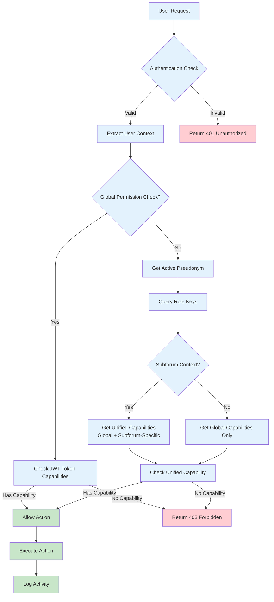
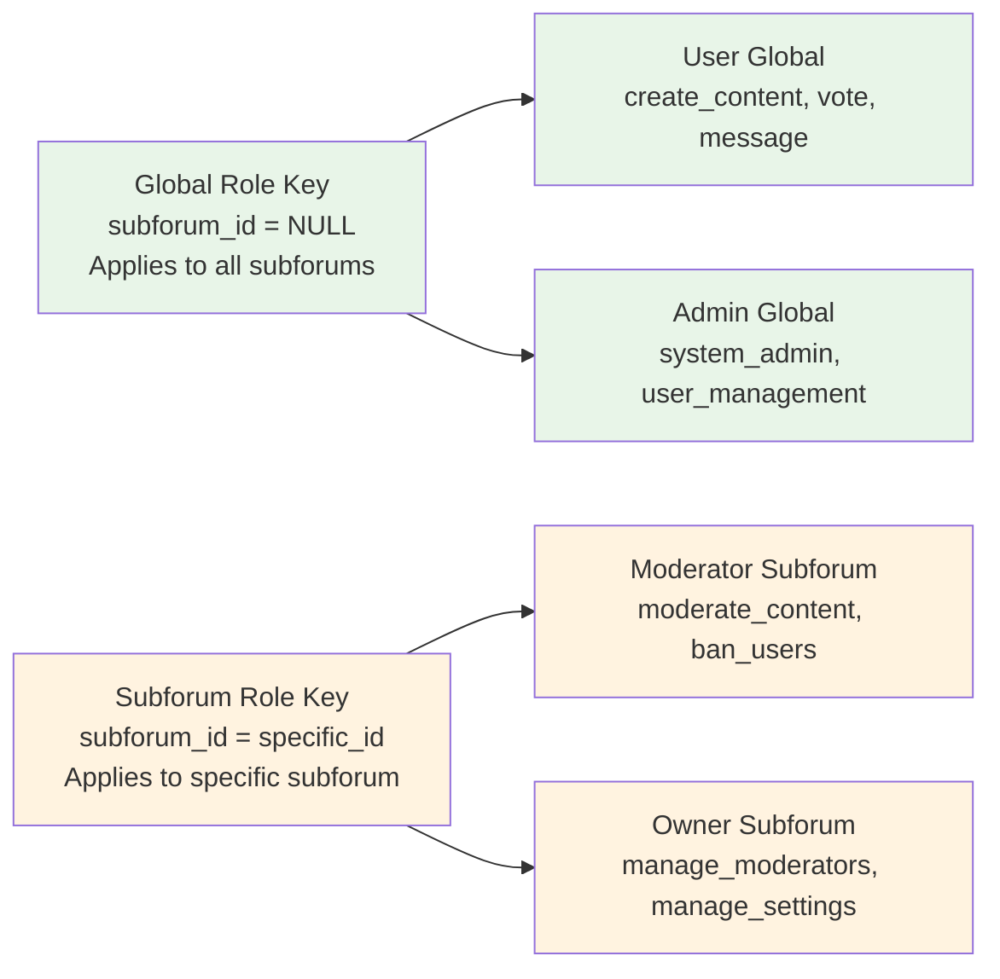
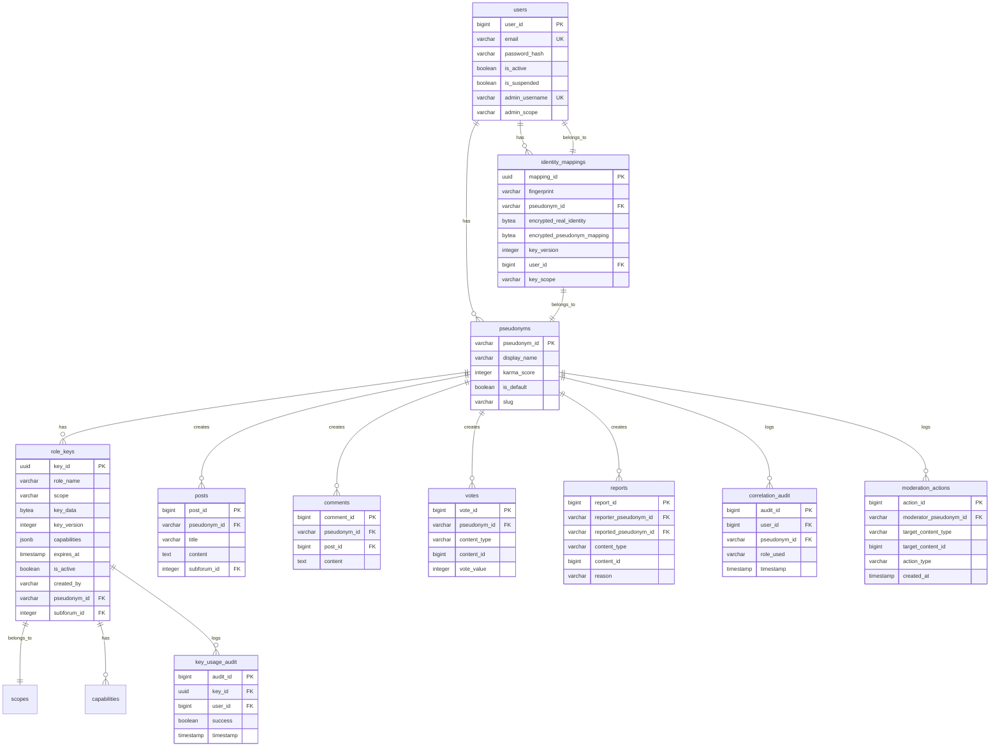

# HashPost Permission System Relationships

## System Architecture Graph

```mermaid
graph TB
    %% Core Entities
    User[User<br/>user_id, email, password_hash<br/>No roles/capabilities]
    Pseudonym[Pseudonym<br/>pseudonym_id, display_name<br/>is_default, karma_score]
    RoleKey[Role Key<br/>key_id, role_name, scope<br/>capabilities, expires_at<br/>subforum_id (NULL=global)]
    IdentityMapping[Identity Mapping<br/>mapping_id, fingerprint<br/>encrypted_real_identity<br/>encrypted_pseudonym_mapping]
    
    %% Cryptographic Domains
    DomainKeys[Domain Keys<br/>user_pseudonyms_v1<br/>user_self_correlation_v1<br/>moderator_correlation_v1<br/>admin_correlation_v1<br/>legal_correlation_v1]
    
    %% Scopes
    Scopes[Scopes<br/>authentication<br/>self_correlation<br/>moderation<br/>administration<br/>correlation]
    
    %% Capabilities
    Capabilities[Capabilities<br/>create_content, vote, message<br/>moderate_content, ban_users<br/>access_all_pseudonyms<br/>system_admin, etc.]
    
    %% Content Tables
    Posts[Posts<br/>pseudonym_id FK]
    Comments[Comments<br/>pseudonym_id FK]
    Votes[Votes<br/>pseudonym_id FK]
    Reports[Reports<br/>reporter_pseudonym_id<br/>reported_pseudonym_id]
    
    %% Audit Tables
    CorrelationAudit[Correlation Audit<br/>user_id, pseudonym_id<br/>role_used, timestamp]
    KeyUsageAudit[Key Usage Audit<br/>key_id, user_id<br/>success, timestamp]
    ModerationActions[Moderation Actions<br/>moderator_pseudonym_id<br/>target_content_type]
    
    %% Relationships
    User -->|1:N| Pseudonym
    User -->|1:N| IdentityMapping
    Pseudonym -->|1:N| RoleKey
    Pseudonym -->|1:N| Posts
    Pseudonym -->|1:N| Comments
    Pseudonym -->|1:N| Votes
    Pseudonym -->|1:N| Reports
    
    %% Role Key Relationships
    RoleKey -->|Many:1| Scopes
    RoleKey -->|Many:1| Capabilities
    RoleKey -->|Uses| DomainKeys
    
    %% Identity Mapping Relationships
    IdentityMapping -->|Many:1| User
    IdentityMapping -->|Many:1| Pseudonym
    
    %% Audit Relationships
    CorrelationAudit -->|Logs| User
    CorrelationAudit -->|Logs| Pseudonym
    KeyUsageAudit -->|Logs| RoleKey
    ModerationActions -->|Logs| Pseudonym
    
    %% Styling
    classDef userClass fill:#e1f5fe
    classDef pseudonymClass fill:#f3e5f5
    classDef roleKeyClass fill:#fff3e0
    classDef domainClass fill:#e8f5e8
    classDef scopeClass fill:#fce4ec
    classDef capabilityClass fill:#f1f8e9
    classDef contentClass fill:#fff8e1
    classDef auditClass fill:#fafafa
    
    class User userClass
    class Pseudonym pseudonymClass
    class RoleKey roleKeyClass
    class DomainKeys domainClass
    class Scopes scopeClass
    class Capabilities capabilityClass
    class Posts,Comments,Votes,Reports contentClass
    class CorrelationAudit,KeyUsageAudit,ModerationActions auditClass
```

## Permission Flow Diagram



## Role Key Structure



## Domain Key Separation

```mermaid
graph TB
    %% IBE System
    IBESystem[IBE System<br/>Multi-Domain Architecture]
    
    %% Domain Keys
    UserPseudonyms[User Pseudonyms Domain<br/>user_pseudonyms_v1<br/>Generate pseudonym IDs]
    UserCorrelation[User Self-Correlation Domain<br/>user_self_correlation_v1<br/>User identity verification]
    ModCorrelation[Moderator Correlation Domain<br/>moderator_correlation_v1<br/>Subforum moderation]
    AdminCorrelation[Admin Correlation Domain<br/>admin_correlation_v1<br/>Platform administration]
    LegalCorrelation[Legal Correlation Domain<br/>legal_correlation_v1<br/>Legal compliance]
    
    %% Role Mappings
    UserRole[User Role] --> UserCorrelation
    ModeratorRole[Moderator Role] --> ModCorrelation
    AdminRole[Admin Role] --> AdminCorrelation
    LegalRole[Legal Role] --> LegalCorrelation
    
    %% System Relationships
    IBESystem --> UserPseudonyms
    IBESystem --> UserCorrelation
    IBESystem --> ModCorrelation
    IBESystem --> AdminCorrelation
    IBESystem --> LegalCorrelation
    
    %% Security Benefits
    SecurityBenefits[Security Benefits<br/>• Privilege isolation<br/>• Cryptographic boundaries<br/>• Compromise containment]
    
    IBESystem --> SecurityBenefits
    
    %% Styling
    classDef domainClass fill:#e8f5e8
    classDef roleClass fill:#fff3e0
    classDef systemClass fill:#e3f2fd
    classDef benefitClass fill:#fce4ec
    
    class UserPseudonyms,UserCorrelation,ModCorrelation,AdminCorrelation,LegalCorrelation domainClass
    class UserRole,ModeratorRole,AdminRole,LegalRole roleClass
    class IBESystem systemClass
    class SecurityBenefits benefitClass
```



## Permission Checking Patterns

```mermaid
graph TD
    %% Two Permission Systems
    GlobalSystem[Global Permission System<br/>JWT Token Cached<br/>userCtx.HasCapability()]
    UnifiedSystem[Unified Permission System<br/>Database Role Keys<br/>permissionDAO.HasUnifiedCapability()]
    
    %% Global System Usage
    GlobalSystem --> GlobalUse[Use For:<br/>• create_content<br/>• vote<br/>• message<br/>• report<br/>• Site-wide actions]
    
    %% Unified System Usage
    UnifiedSystem --> UnifiedUse[Use For:<br/>• moderate_content<br/>• ban_users<br/>• manage_subforum_settings<br/>• Subforum-specific actions]
    
    %% Code Examples
    GlobalCode[```go
if !userCtx.HasCapability(
    constants.CapabilityCreateContent) {
    return huma.Error403Forbidden(
        "insufficient permissions")
}
```]
    
    UnifiedCode[```go
hasCapability, err := 
    h.permissionDAO.HasUnifiedCapability(
        ctx, userCtx.UserID, 
        userCtx.ActivePseudonymID,
        constants.CapabilityModerateContent, 
        &subforumID)
```]
    
    GlobalSystem --> GlobalCode
    UnifiedSystem --> UnifiedCode
    
    %% Styling
    classDef globalClass fill:#e8f5e8
    classDef unifiedClass fill:#fff3e0
    classDef codeClass fill:#f5f5f5
    
    class GlobalSystem,GlobalUse globalClass
    class UnifiedSystem,UnifiedUse unifiedClass
    class GlobalCode,UnifiedCode codeClass
```

## Role Hierarchy and Capabilities

```mermaid
graph TB
    %% Role Hierarchy
    PlatformAdmin[Platform Admin<br/>Global Role<br/>All capabilities]
    TrustSafety[Trust & Safety<br/>Global Role<br/>moderation, compliance]
    LegalTeam[Legal Team<br/>Global Role<br/>compliance, legal_requests]
    SubforumOwner[Subforum Owner<br/>Subforum-Specific<br/>All subforum capabilities]
    Moderator[Moderator<br/>Subforum-Specific<br/>moderate_content, ban_users<br/>(Auto-assigned)]
    User[User<br/>Global Role<br/>create_content, vote, message]
    
    %% Hierarchy Relationships
    PlatformAdmin --> TrustSafety
    PlatformAdmin --> LegalTeam
    PlatformAdmin --> SubforumOwner
    SubforumOwner --> Moderator
    Moderator --> User
    
    %% Capability Flow
    Capabilities[Capabilities Flow:<br/>• Global capabilities from role keys<br/>• Subforum capabilities from role keys<br/>• Automatic role assignment<br/>• Duplicate removal]
    
    PlatformAdmin --> Capabilities
    TrustSafety --> Capabilities
    LegalTeam --> Capabilities
    SubforumOwner --> Capabilities
    Moderator --> Capabilities
    User --> Capabilities
    
    %% Styling
    classDef adminClass fill:#ffcdd2
    classDef globalClass fill:#e8f5e8
    classDef subforumClass fill:#fff3e0
    classDef userClass fill:#f3e5f5
    classDef capabilityClass fill:#fce4ec
    
    class PlatformAdmin adminClass
    class TrustSafety,LegalTeam globalClass
    class SubforumOwner,Moderator subforumClass
    class User userClass
    class Capabilities capabilityClass
```

## Database Schema Relationships



## Key Insights

### 1. **Separation of Concerns**
- **Users**: Pure authentication layer (no roles/capabilities)
- **Pseudonyms**: Identity layer with roles/capabilities via role keys
- **Role Keys**: Primary permission storage with cryptographic domain separation

### 2. **Two Permission Systems**
- **Global System**: JWT token cached capabilities for site-wide actions
- **Unified System**: Database role keys for granular, context-aware permissions

### 3. **Cryptographic Security**
- **Domain Separation**: Each privilege level has separate cryptographic keys
- **Time-Bounded Keys**: Forward secrecy through time-windowed key derivation
- **Privacy Protection**: Real identities encrypted, fingerprints used for correlation

### 4. **Flexible Architecture**
- **Global Role Keys**: Apply across all subforums (`subforum_id = NULL`)
- **Subforum-Specific Role Keys**: Apply only to specific subforums
- **Automatic Role Assignment**: "moderator" role added when subforum capabilities present

### 5. **Comprehensive Auditing**
- **Correlation Audit**: Logs all identity correlation activities
- **Key Usage Audit**: Logs all cryptographic key usage
- **Moderation Actions**: Logs all content moderation activities

This architecture provides a sophisticated, secure, and flexible permission system that balances user privacy with administrative accountability while supporting complex social platform requirements. 