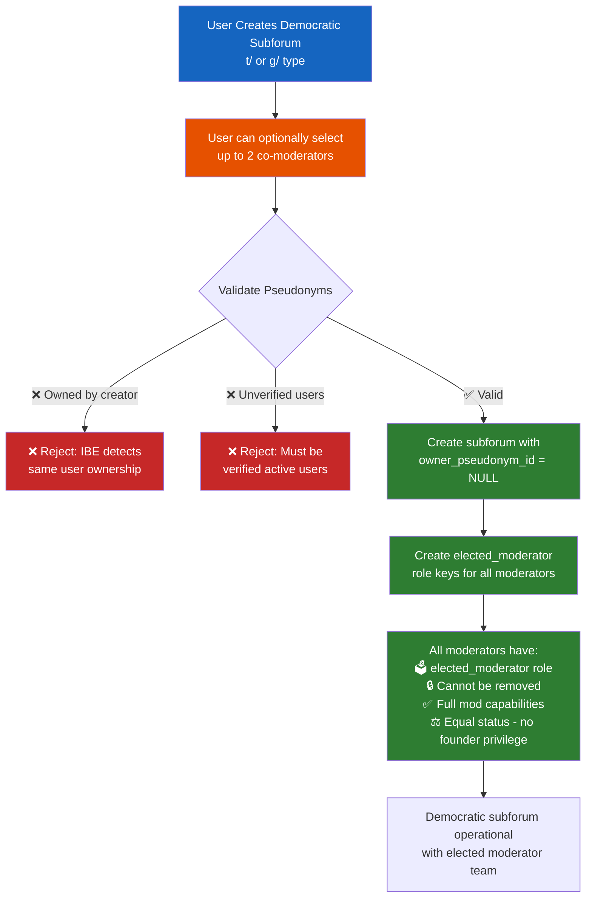
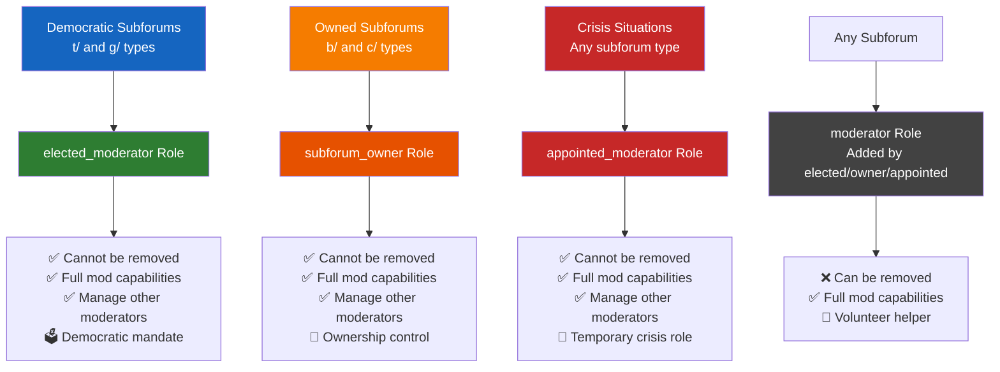

# Democratic Governance Design

## Overview

This document outlines the design for democratic governance in HashPost subforums. Democratic communities (t/ and g/ types) should be community-controlled rather than owned by a single individual, but require special bootstrapping mechanisms to prevent exploitation in small communities.

**Status**: Design Phase - Elections not yet implemented

## Core Principles

### 1. Community Control
- Democratic subforums have no permanent "owner"
- Moderators are elected by the community, not appointed by an owner
- Community decisions are made collectively by elected moderators

### 2. Anti-Exploitation Protection
- Elections only activate when communities reach sufficient size
- Initial moderators get "elected" status to prevent gaming
- Platform admins can intervene in crisis situations

### 3. Graduated Democracy
- Start with founder-led bootstrap phase
- Transition to full democracy when community matures
- Maintain democratic principles throughout lifecycle

## System Design

### Democratic Subforum Creation Flow



### Democratic Subforum Creation

#### Initial Setup Requirements
1. **No Special Creator Role**: Creator becomes one of the elected moderators (NOT subforum_owner)
2. **Flexible Team Size**: Can start with just the creator (single moderator) or add up to 4 co-moderators
3. **Pseudonym Validation**: Co-moderators must be:
   - Not owned by the creator (verified via IBE system)
   - Tied to active and verified users
4. **No Owner**: `owner_pseudonym_id` remains NULL

#### Bootstrap Phase Rules
- All initial moderators (creator + optional co-moderators) have `elected_moderator` role and cannot be removed
- All elected moderators have full moderation capabilities
- No special privileges for the subforum creator - they're just one of the elected moderators
- Community operates under initial elected moderator team until election threshold
- Single moderator communities are valid and can add co-moderators later through the democratic process

### Role Type Comparison



### Moderator Types

Only two role types exist in the system:

#### 1. Elected Moderators
- **Role**: `elected_moderator` 
- **Source**: Community elections (future) or initial bootstrap team (including creator)
- **Protection**: Cannot be removed by other moderators
- **Permissions**: All moderation capabilities
- **Term**: Until next election cycle or community recall
- **Note**: Creator has no special status - just one of the elected moderators

#### 2. Appointed Moderators (Crisis Management)
- **Role**: `appointed_moderator`
- **Source**: Platform admin intervention during crisis
- **Purpose**: Temporary crisis management
- **Permissions**: All moderation capabilities  
- **Duration**: Until crisis resolved and elections re-held

#### Volunteer Moderators (Not a separate role)
Elected moderators can add additional moderators with regular `moderator` role:
- **Role**: `moderator` (standard role, not democratic-specific)
- **Source**: Added by elected moderators
- **Removal**: Can be freely added/removed by elected moderators
- **Permissions**: All moderation capabilities
- **Purpose**: Help with workload, training ground for future candidates

### Election System (Future Implementation)

```mermaid
graph TD
    %% Future Election System Flow
    A[Democratic Subforum<br/>Operating with elected mods] --> B{Community reaches<br/>election threshold?}
    
    B -->|No| C[Continue with current<br/>elected moderators]
    B -->|Yes| D[🗳️ Election System Activates]
    
    D --> E[Nomination Period<br/>Community members nominate<br/>candidates for moderator]
    
    E --> F[Campaign Period<br/>Candidates present platforms<br/>and engage with community]
    
    F --> G[Voting Period<br/>📊 Ranked Choice Voting<br/>👥 Subscribers only]
    
    G --> H[Election Results<br/>Calculate winners using<br/>ranked choice algorithm]
    
    H --> I[Transition Period<br/>🔄 Remove old elected_moderator roles<br/>➕ Create new elected_moderator roles]
    
    I --> J[New elected moderator team<br/>takes over governance]
    
    %% Crisis Branch
    C --> K{Community crisis?}
    K -->|No| C
    K -->|Yes| L[🚨 Platform Admin Intervention<br/>Appoint crisis moderators]
    
    L --> M[appointed_moderator roles<br/>temporarily manage community]
    
    M --> N{Crisis resolved?}
    N -->|No| M
    N -->|Yes| O[Remove appointed roles<br/>Schedule new elections]
    
    O --> D
    
    style D fill:#f57c00,color:#fff
    style G fill:#1565c0,color:#fff
    style I fill:#2e7d32,color:#fff
    style L fill:#c62828,color:#fff
    style M fill:#e65100,color:#fff

```



#### Activation Triggers
Elections activate when community reaches **both** criteria:
- **Size Threshold**: Minimum subscriber count (TBD - likely 500-1000+)
- **Time Threshold**: Minimum community age (likely 1 year)
- **Activity Threshold**: Minimum engagement level

#### Election Features
- **Voting Method**: Ranked choice voting
- **Eligibility**: Subscribers only (may add activity/age requirements)
- **Candidate Pool**: Self-nomination or community nomination
- **Term Length**: TBD (likely 1-2 years)
- **Recall Mechanism**: Community can recall moderators mid-term

#### Election Security
- **Voter Verification**: Prevent sock puppet accounts
- **Campaign Rules**: Fair candidate promotion
- **Transparency**: Public election results and process

### Crisis Management

#### Platform Admin Intervention
When democratic communities face crisis:
1. Platform admins can appoint temporary moderators
2. Appointed moderators get `appointed` capability
3. Crisis moderators have full permissions but are clearly temporary
4. Once crisis resolved, new elections held
5. Appointed moderators removed, elected moderators restored

#### Crisis Triggers
- All elected moderators inactive
- Community governance breakdown
- Legal/safety issues requiring immediate intervention
- Coordinated attacks or brigading

## Implementation Phases

### Phase 1: Fix Current Problem ✅ Ready to Implement
- Add `elected_moderator` and `appointed_moderator` role constants and definitions
- Add new role entries to `role_definitions` database table  
- Modify subforum creation to not assign owner role for democratic communities
- Allow single moderator with optional co-moderators (up to 4 total)
- Validate selected pseudonyms are not owned by creator (via IBE) and tied to verified users

### Phase 2: Election Infrastructure (Future)
- Design election database schema
- Implement voting system
- Create election scheduling and management
- Build candidate nomination system

### Phase 3: Advanced Democracy Features (Future)
- Recall elections
- Community rule voting
- Advanced governance mechanisms
- Integration with platform moderation

## Database Schema Changes Needed

### New Role Key Requirements

Democratic governance requires **new role keys** because:
1. **Different role names** enable governance logic (elected vs appointed vs owner)
2. **Same capabilities** as `subforum_owner` but different role identity
3. **Permission system** can distinguish roles for removal/appointment logic

### Immediate (Phase 1)

#### Role Constants (Go Code)
```go
// Add to internal/api/constants/roles.go
RoleElectedModerator = "elected_moderator"
RoleAppointedModerator = "appointed_moderator"
```

#### Role Definitions (Database)
```sql
-- Add new role definitions to role_definitions table
INSERT INTO role_definitions (role_name, display_name, description, capabilities, correlation_access, scope, time_window) VALUES
('elected_moderator', 'Elected Moderator', 'Community-elected moderator for democratic subforums', '["moderate_content", "ban_users", "remove_content", "correlate_fingerprints", "manage_moderators", "review_reports", "forward_reports", "manage_subforum_rules", "manage_subforum_settings"]', 'fingerprint', 'subforum_specific', '90_days'),
('appointed_moderator', 'Appointed Moderator', 'Platform-appointed moderator for crisis management', '["moderate_content", "ban_users", "remove_content", "correlate_fingerprints", "manage_moderators", "review_reports", "forward_reports", "manage_subforum_rules", "manage_subforum_settings"]', 'fingerprint', 'subforum_specific', '30_days');
```

#### Role Definition Functions (Go Code)
```go
// Add to GetRoleDefinitions() in internal/api/constants/roles.go
{
    RoleName: RoleElectedModerator,
    Scopes:   []string{ScopeAuthentication, ScopeSelfCorrelation, ScopeModeration, ScopeCorrelation},
    Capabilities: map[string][]string{
        // Same capabilities as RoleSubforumOwner
        ScopeModeration: {
            CapabilityModerateContent,
            CapabilityBanUsers,
            CapabilityRemoveContent,
            CapabilityManageModerators,
            CapabilityReviewReports,
            CapabilityForwardReports,
            CapabilityManageSubforumRules,
            CapabilityManageSubforumSettings,
        },
        // ... other scopes
    },
},
{
    RoleName: RoleAppointedModerator,
    // Same structure as elected_moderator
},
```

#### IBE Domain Key Mapping (Go Code)
```go
// Update selectDomain() in internal/ibe/ibe.go
case "moderator", "subforum_owner", "elected_moderator", "appointed_moderator":
    return DOMAIN_MOD_CORRELATION
```

### Future (Phase 2)
```sql
-- Elections table
CREATE TABLE subforum_elections (
    election_id BIGSERIAL PRIMARY KEY,
    subforum_id INTEGER NOT NULL,
    election_type VARCHAR(20) NOT NULL, -- 'regular', 'recall', 'special'
    start_date TIMESTAMP WITH TIME ZONE NOT NULL,
    end_date TIMESTAMP WITH TIME ZONE NOT NULL,
    status VARCHAR(20) NOT NULL, -- 'scheduled', 'active', 'completed', 'cancelled'
    created_at TIMESTAMP WITH TIME ZONE DEFAULT CURRENT_TIMESTAMP,
    
    FOREIGN KEY (subforum_id) REFERENCES subforums(subforum_id) ON DELETE CASCADE
);

-- Election candidates
CREATE TABLE election_candidates (
    candidate_id BIGSERIAL PRIMARY KEY,
    election_id BIGINT NOT NULL,
    pseudonym_id VARCHAR(64) NOT NULL,
    nomination_statement TEXT,
    nominated_at TIMESTAMP WITH TIME ZONE DEFAULT CURRENT_TIMESTAMP,
    nominated_by_pseudonym_id VARCHAR(64),
    
    UNIQUE (election_id, pseudonym_id),
    FOREIGN KEY (election_id) REFERENCES subforum_elections(election_id) ON DELETE CASCADE,
    FOREIGN KEY (pseudonym_id) REFERENCES pseudonyms(pseudonym_id) ON DELETE CASCADE
);

-- Election votes (ranked choice)
CREATE TABLE election_votes (
    vote_id BIGSERIAL PRIMARY KEY,
    election_id BIGINT NOT NULL,
    voter_pseudonym_id VARCHAR(64) NOT NULL,
    ranked_choices JSONB NOT NULL, -- Array of candidate_ids in preference order
    cast_at TIMESTAMP WITH TIME ZONE DEFAULT CURRENT_TIMESTAMP,
    
    UNIQUE (election_id, voter_pseudonym_id),
    FOREIGN KEY (election_id) REFERENCES subforum_elections(election_id) ON DELETE CASCADE,
    FOREIGN KEY (voter_pseudonym_id) REFERENCES pseudonyms(pseudonym_id) ON DELETE CASCADE
);
```

## Technical Implementation Notes

### Role Key Management
- Democratic subforums should never have `subforum_owner` role keys
- Initial team gets `elected_moderator` role keys
- Volunteer moderators get `moderator` role keys
- Crisis moderators get `appointed_moderator` role keys

### Permission Checking
- `elected_moderator` role prevents removal by other moderators
- `appointed_moderator` role indicates temporary crisis management
- All moderator types have same functional capabilities (moderate_content, etc.)
- Role differences only affect governance, not day-to-day moderation

### Community Transitions
- Track community maturity metrics (size, age, activity)
- Automatic election scheduling when thresholds met
- Graceful transition from bootstrap to elected governance
- Preserve community continuity during transitions

## Open Questions for Future Development

1. **Election Timing**: What subscriber/activity thresholds trigger elections?
2. **Voter Eligibility**: What requirements for voting (age, activity, etc.)?
3. **Candidate Requirements**: Who can run for moderator positions?
4. **Term Structure**: How long do elected terms last?
5. **Recall Process**: How can community remove ineffective moderators?
6. **Rule Changes**: Do rule modifications require community votes?
7. **Emergency Powers**: What platform admin intervention rules?

## Benefits of This Approach

### Immediate Benefits
- Fixes incorrect owner assignment for democratic communities
- Establishes proper governance foundation
- Prevents single-person control of democratic spaces
- Maintains community integrity from day one

### Future Benefits
- Smooth transition to full democratic governance
- Protection against small-group exploitation
- Clear crisis management procedures
- Scalable election system when community ready

### User Experience Benefits
- Clear expectations about governance model
- Transparent moderation structure
- Community ownership and engagement
- Protection from founder abandonment

## Conclusion

This phased approach allows us to:
1. **Fix the immediate problem** of incorrect owner assignment
2. **Establish proper democratic foundations** without complex elections
3. **Plan for future democracy** when communities mature
4. **Maintain flexibility** for crisis management and platform evolution

The key insight is that true democracy requires mature, engaged communities - but we can establish democratic principles from day one through proper role assignment and governance structure.

### Future Enhancements

- **Election Thresholds**: Implement subforum-specific thresholds for moderator elections
- **Co-Moderator Limits**: Allow communities to set their own co-moderator limits (currently max 4)
- **Moderator Removal**: Add democratic processes for removing problematic moderators
- **Term Limits**: Implement optional term limits for elected moderators
