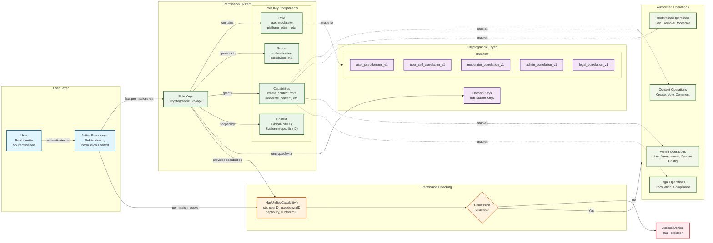

# HashPost RBAC System Architecture Diagrams

This document provides comprehensive visual diagrams showing the relationships between all components in HashPost's Role-Based Access Control (RBAC) system.

## Overview

HashPost uses a sophisticated **unified capability system** that combines traditional role-based permissions with Identity-Based Encryption (IBE) for secure, privacy-preserving operations. These diagrams illustrate how users, pseudonyms, roles, capabilities, domain keys, and scopes work together to provide granular access control.

---

## Diagram 1: Complete System Architecture

This diagram shows the full relationship map of all RBAC components and how they interconnect.

```mermaid
graph TB
    %% Core User Layer
    User["`**User**
    user_id, email
    password_hash
    ⚠️ No roles/capabilities`"]
    
    %% Pseudonym Layer
    Pseudonym["`**Pseudonym**
    pseudonym_id, display_name
    is_default, karma_score
    ⚠️ No direct roles/capabilities`"]
    
    %% Cryptographic Domain Keys (IBE System)
    subgraph DomainKeys["`**Domain Keys (IBE System)**`"]
        UserPseudonymsDomain["`**user_pseudonyms_v1**
        User pseudonym generation`"]
        UserSelfCorrelationDomain["`**user_self_correlation_v1**
        Self-correlation operations`"]
        ModeratorCorrelationDomain["`**moderator_correlation_v1**
        Moderator fingerprint correlation`"]
        AdminCorrelationDomain["`**admin_correlation_v1**
        Platform-wide identity correlation`"]
        LegalCorrelationDomain["`**legal_correlation_v1**
        Legal compliance operations`"]
    end
    
    %% Role Keys (Primary Permission Storage)
    RoleKey["`**Role Key**
    key_id, role_name, scope
    capabilities (JSONB)
    key_data (IBE key), expires_at
    subforum_id (NULL=global)`"]
    
    %% Scopes
    subgraph Scopes["`**Scopes**`"]
        AuthScope["`**authentication**
        Login, session management`"]
        SelfCorrelationScope["`**self_correlation**
        Own pseudonym access`"]
        CorrelationScope["`**correlation**
        Administrative correlation`"]
    end
    
    %% Roles
    subgraph Roles["`**Roles**`"]
        UserRole["`**user**
        Default role for all pseudonyms`"]
        ModeratorRole["`**moderator**
        Dynamically assigned`"]
        SubforumOwnerRole["`**subforum_owner**
        Subforum creator`"]
        PlatformAdminRole["`**platform_admin**
        System administrator`"]
        TrustSafetyRole["`**trust_safety**
        Content moderation`"]
        LegalTeamRole["`**legal_team**
        Legal compliance`"]
    end
    
    %% Capabilities
    subgraph Capabilities["`**Capabilities**`"]
        BasicCaps["`**Basic User**
        create_content, vote
        message, report`"]
        ModerationCaps["`**Moderation**
        moderate_content, ban_users
        remove_content`"]
        AdminCaps["`**Administrative**
        system_admin, user_management
        correlate_identities`"]
        LegalCaps["`**Legal**
        legal_compliance
        court_orders`"]
    end
    
    %% Identity Mappings (Privacy Layer)
    IdentityMapping["`**Identity Mapping**
    mapping_id, fingerprint
    encrypted_real_identity
    encrypted_pseudonym_mapping
    key_scope`"]
    
    %% Content Tables
    subgraph Content["`**Content**`"]
        Posts["`**Posts**
        post_id, title, content
        pseudonym_id (FK)`"]
        Comments["`**Comments**
        comment_id, content
        pseudonym_id (FK)`"]
        Votes["`**Votes**
        vote_id, vote_type
        pseudonym_id (FK)`"]
    end
    
    %% Subforums
    Subforum["`**Subforum**
    subforum_id, name
    description, rules`"]
    
    %% Audit Tables
    subgraph Audit["`**Audit & Security**`"]
        CorrelationAudit["`**Correlation Audit**
        user_id, pseudonym_id
        role_used, timestamp`"]
        KeyUsageAudit["`**Key Usage Audit**
        key_id, user_id
        success, timestamp`"]
        ModerationActions["`**Moderation Actions**
        moderator_pseudonym_id
        target_content_type`"]
    end
    
    %% Primary Relationships
    User -->|"1:N<br/>owns"| Pseudonym
    User -->|"1:N<br/>privacy link"| IdentityMapping
    Pseudonym -->|"1:N<br/>has permissions via"| RoleKey
    
    %% Role Key Relationships
    RoleKey -->|"uses"| Roles
    RoleKey -->|"operates in"| Scopes
    RoleKey -->|"grants"| Capabilities
    RoleKey -->|"encrypted with"| DomainKeys
    RoleKey -->|"optionally scoped to"| Subforum
    
    %% Content Relationships
    Pseudonym -->|"creates"| Posts
    Pseudonym -->|"creates"| Comments
    Pseudonym -->|"creates"| Votes
    Posts -->|"belongs to"| Subforum
    Comments -->|"belongs to"| Subforum
    
    %% Privacy & Security
    IdentityMapping -->|"encrypts link to"| User
    IdentityMapping -->|"encrypts link to"| Pseudonym
    IdentityMapping -->|"uses scope"| Scopes
    
    %% Domain Key Usage
    UserRole -.->|"uses"| UserSelfCorrelationDomain
    ModeratorRole -.->|"uses"| ModeratorCorrelationDomain
    PlatformAdminRole -.->|"uses"| AdminCorrelationDomain
    LegalTeamRole -.->|"uses"| LegalCorrelationDomain
    
    %% Capability Assignment
    UserRole -.->|"grants"| BasicCaps
    ModeratorRole -.->|"grants"| ModerationCaps
    PlatformAdminRole -.->|"grants"| AdminCaps
    LegalTeamRole -.->|"grants"| LegalCaps
    
    %% Audit Relationships
    RoleKey -->|"usage tracked in"| KeyUsageAudit
    IdentityMapping -->|"correlation tracked in"| CorrelationAudit
    ModerationCaps -->|"actions tracked in"| ModerationActions
    
    %% Styling
    classDef userLayer fill:#e1f5fe,stroke:#01579b,stroke-width:2px
    classDef cryptoLayer fill:#f3e5f5,stroke:#4a148c,stroke-width:2px
    classDef permissionLayer fill:#e8f5e8,stroke:#1b5e20,stroke-width:2px
    classDef contentLayer fill:#fff3e0,stroke:#e65100,stroke-width:2px
    classDef auditLayer fill:#fce4ec,stroke:#880e4f,stroke-width:2px
    
    class User,Pseudonym userLayer
    class DomainKeys,IdentityMapping cryptoLayer
    class RoleKey,Roles,Scopes,Capabilities permissionLayer
    class Content,Subforum contentLayer
    class Audit auditLayer
```



### Key Components Explained

**User Layer (Blue)**
- **Users**: Real identities with no direct permissions
- **Pseudonyms**: Public identities that inherit permissions through role keys

**Cryptographic Layer (Purple)**
- **Domain Keys**: IBE master keys providing cryptographic separation
- **Identity Mappings**: Encrypted links between real identities and pseudonyms

**Permission Layer (Green)**
- **Role Keys**: Primary permission storage with cryptographic protection
- **Roles**: User roles (user, moderator, admin, etc.)
- **Scopes**: Operational contexts (authentication, correlation, etc.)
- **Capabilities**: Specific operations within each scope

**Content Layer (Orange)**
- **Posts, Comments, Votes**: User-generated content linked to pseudonyms
- **Subforums**: Content organization and context for permissions

**Audit Layer (Pink)**
- **Correlation Audit**: Tracks identity correlation operations
- **Key Usage Audit**: Monitors cryptographic key usage
- **Moderation Actions**: Records moderation activities

---

## Diagram 2: Permission Flow

This diagram illustrates the step-by-step process of how permissions are checked and granted.



### Permission Flow Steps

1. **Authentication**: User authenticates and selects active pseudonym
2. **Permission Storage**: Pseudonym's permissions are stored in role keys
3. **Cryptographic Protection**: Role keys are encrypted with domain-specific IBE keys
4. **Permission Request**: System calls `HasUnifiedCapability()` with context
5. **Capability Resolution**: System checks role keys for required capability
6. **Access Decision**: Permission granted or denied based on capability check
7. **Operation Execution**: If granted, user can perform the requested operation

---

## Diagram 3: Role Hierarchy and Domain Mapping

This diagram shows the hierarchical relationships between roles and their corresponding domain key usage.

```mermaid
graph TD
    %% Role Hierarchy and Domain Key Mapping
    subgraph RoleHierarchy["Role Hierarchy"]
        PlatformAdmin["Platform Admin<br/>🔑 Full System Access"]
        TrustSafety["Trust & Safety<br/>🔍 Content Moderation"]
        LegalTeam["Legal Team<br/>⚖️ Compliance Operations"]
        SubforumOwner["Subforum Owner<br/>👑 Subforum Management"]
        Moderator["Moderator<br/>🛡️ Content Moderation"]
        User["User<br/>👤 Basic Operations"]
    end
    
    subgraph DomainKeys["IBE Domain Keys"]
        UserPseudonymsDomain["user_pseudonyms_v1<br/>👤 Pseudonym Generation"]
        UserSelfCorrelationDomain["user_self_correlation_v1<br/>🔗 Self-Correlation"]
        ModeratorCorrelationDomain["moderator_correlation_v1<br/>🛡️ Moderator Correlation"]
        AdminCorrelationDomain["admin_correlation_v1<br/>🔑 Admin Correlation"]
        LegalCorrelationDomain["legal_correlation_v1<br/>⚖️ Legal Correlation"]
    end
    
    subgraph Capabilities["Capabilities by Role"]
        BasicCaps["Basic Capabilities<br/>• create_content<br/>• vote<br/>• message<br/>• report"]
        
        ModerationCaps["Moderation Capabilities<br/>• moderate_content<br/>• ban_users<br/>• remove_content<br/>• manage_subforum_settings"]
        
        AdminCaps["Administrative Capabilities<br/>• system_admin<br/>• user_management<br/>• correlate_identities<br/>• access_all_pseudonyms"]
        
        LegalCaps["Legal Capabilities<br/>• legal_compliance<br/>• court_orders<br/>• correlate_identities<br/>• access_all_pseudonyms"]
    end
    
    subgraph Scopes["Operation Scopes"]
        AuthScope["authentication<br/>Login & Sessions"]
        SelfScope["self_correlation<br/>Own Pseudonym Access"]
        CorrelationScope["correlation<br/>Cross-User Operations"]
    end
    
    %% Role Hierarchy
    PlatformAdmin -.->|"supervises"| TrustSafety
    PlatformAdmin -.->|"supervises"| LegalTeam
    SubforumOwner -.->|"manages"| Moderator
    Moderator -.->|"elevated from"| User
    
    %% Domain Key Mappings
    User -->|"uses"| UserSelfCorrelationDomain
    User -->|"generates via"| UserPseudonymsDomain
    
    Moderator -->|"uses"| ModeratorCorrelationDomain
    Moderator -->|"inherits"| UserSelfCorrelationDomain
    
    SubforumOwner -->|"uses"| ModeratorCorrelationDomain
    SubforumOwner -->|"inherits"| UserSelfCorrelationDomain
    
    TrustSafety -->|"uses"| AdminCorrelationDomain
    TrustSafety -->|"inherits"| ModeratorCorrelationDomain
    
    PlatformAdmin -->|"uses"| AdminCorrelationDomain
    PlatformAdmin -->|"inherits"| ModeratorCorrelationDomain
    
    LegalTeam -->|"uses"| LegalCorrelationDomain
    LegalTeam -->|"special access"| AdminCorrelationDomain
    
    %% Capability Assignments
    User -->|"grants"| BasicCaps
    Moderator -->|"grants"| ModerationCaps
    SubforumOwner -->|"grants"| ModerationCaps
    PlatformAdmin -->|"grants"| AdminCaps
    TrustSafety -->|"grants"| AdminCaps
    LegalTeam -->|"grants"| LegalCaps
    
    %% Scope Usage
    BasicCaps -->|"operates in"| AuthScope
    BasicCaps -->|"operates in"| SelfScope
    ModerationCaps -->|"operates in"| CorrelationScope
    AdminCaps -->|"operates in"| CorrelationScope
    LegalCaps -->|"operates in"| CorrelationScope
    
    %% Context Indicators
    GlobalContext["🌍 Global Context<br/>subforum_id = NULL"]
    SubforumContext["🏘️ Subforum Context<br/>subforum_id = specific_id"]
    
    BasicCaps -.->|"can be"| GlobalContext
    ModerationCaps -.->|"can be"| SubforumContext
    ModerationCaps -.->|"can be"| GlobalContext
    AdminCaps -.->|"always"| GlobalContext
    LegalCaps -.->|"always"| GlobalContext
    
    %% Styling
    classDef roleHigh fill:#ffcdd2,stroke:#c62828,stroke-width:3px
    classDef roleMid fill:#fff3e0,stroke:#e65100,stroke-width:2px
    classDef roleBasic fill:#e8f5e8,stroke:#1b5e20,stroke-width:2px
    classDef domainKey fill:#f3e5f5,stroke:#4a148c,stroke-width:2px
    classDef capability fill:#e1f5fe,stroke:#01579b,stroke-width:2px
    classDef scope fill:#f9fbe7,stroke:#33691e,stroke-width:2px
    classDef context fill:#fce4ec,stroke:#880e4f,stroke-width:1px,stroke-dasharray: 5 5
    
    class PlatformAdmin,TrustSafety,LegalTeam roleHigh
    class SubforumOwner,Moderator roleMid
    class User roleBasic
    class UserPseudonymsDomain,UserSelfCorrelationDomain,ModeratorCorrelationDomain,AdminCorrelationDomain,LegalCorrelationDomain domainKey
    class BasicCaps,ModerationCaps,AdminCaps,LegalCaps capability
    class AuthScope,SelfScope,CorrelationScope scope
    class GlobalContext,SubforumContext context
```



### Role Hierarchy Explanation

**High-Level Roles (Red)**
- **Platform Admin**: Full system access with admin correlation domain
- **Trust & Safety**: Content moderation with admin correlation capabilities
- **Legal Team**: Compliance operations with dedicated legal correlation domain

**Mid-Level Roles (Orange)**
- **Subforum Owner**: Manages specific subforums with moderator capabilities
- **Moderator**: Content moderation within assigned subforums

**Basic Role (Green)**
- **User**: Standard platform user with basic content and self-correlation capabilities

### Domain Key Security

Each role uses specific IBE domain keys for cryptographic separation:
- **Privilege Isolation**: Lower privilege keys cannot access higher privilege operations
- **Forward Secrecy**: Key compromise at one level doesn't affect other levels
- **Audit Trail**: All key usage is tracked and logged

---

## Key Security Features

### 1. Cryptographic Domain Separation
- Each privilege level uses separate IBE master keys
- Prevents privilege escalation attacks
- Mathematically isolated cryptographic boundaries

### 2. Role-Based Access Control
- Granular capabilities assigned through role keys
- Dynamic role assignment (e.g., "moderator" when subforum capabilities present)
- Context-aware permissions (global vs subforum-specific)

### 3. Privacy Protection
- Real identities encrypted and separated from pseudonyms
- Fingerprint-based correlation instead of direct identity links
- Administrative keys required for identity correlation

### 4. Audit and Compliance
- All permission checks and key usage logged
- Correlation operations tracked with justification
- Moderation actions recorded with context

### 5. Forward Secrecy
- Time-bounded key derivation
- Historical data protected even if current keys compromised
- Regular key rotation capabilities

---

## Implementation Notes

### Permission Checking
All permission checks use the unified capability system:
```go
hasCapability, err := h.permissionDAO.HasUnifiedCapability(
    ctx, userCtx.UserID, userCtx.ActivePseudonymID, 
    constants.CapabilityRequired, subforumID) // nil for global, &subforumID for subforum-specific
```

### Context Usage
- **Global capabilities**: Pass `nil` as `subforumID`
- **Subforum-specific capabilities**: Pass `&subforum.SubforumID`
- **Never pass uninitialized pointers**

### Role Key Structure
Role keys contain:
- **Role name**: user, moderator, platform_admin, etc.
- **Scope**: authentication, self_correlation, correlation
- **Capabilities**: JSON array of specific operations
- **Context**: NULL for global, specific ID for subforum-specific
- **IBE key data**: Encrypted with appropriate domain key

---

## Related Documentation

- **[RBAC Overview](rbac-overview.md)** - Complete system understanding
- **[Permission Checking Patterns](permission-checking-patterns.md)** - Developer implementation guide
- **[Unified Permission System](unified-permission-system.md)** - System architecture details
- **[User Roles](user-roles.md)** - Role definitions and capabilities
- **[Role Keys and Site Roles](role-keys-and-site-roles.md)** - Cryptographic key management
